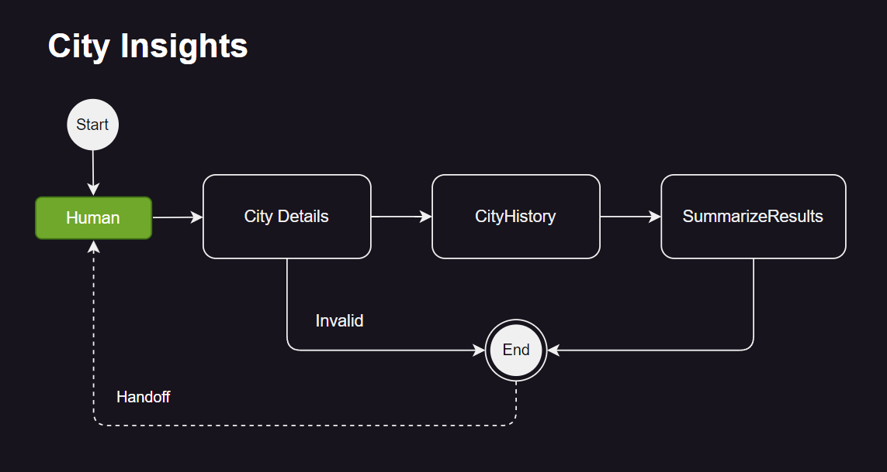

# Agents with Design Patterns

This repository showcases a collection of simple AI agents designed to demonstrate various design patterns in AI-driven workflows. Each pattern is implemented with practical examples and detailed explanations to help developers and researchers understand and apply these concepts effectively in their projects.

To keep things lightweight and reduce complexity, the examples will minimize framework dependencies. We've chosen [Pydantic AI](https://ai.pydantic.dev/) for agentic development because it is both lightweight and provides the essential building blocks for building production-quality AI agents.

Additionally, all use cases (except one) leverage [Pydantic Graphs](https://ai.pydantic.dev/api/pydantic_graph/graph/) to structure agent workflows. Using graph-based workflows from the outset is a good design practice for several reasons:

- Most agentic workflows involve multiple agents. A graph-based approach provides a consistent foundational pattern, making it easier to understand and maintain across development teams.  
- Introducing workflows early in the SDLC makes it significantly easier when extensibility is a priority.

### Considerations

#### Use-Cases  
The example scenarios in this repository are intentionally simple—arguably contrived and even useless. That’s the point. The goal is to eliminate unnecessary distractions and focus purely on **Agent Design Patterns**.

#### Disclaimer  
I come from a C# background, so my Python skills may not be perfect. Suggestions for improvements are always welcome!


## Design Patterns Covered

This section highlights various design patterns commonly used in AI agent development. For a deeper understanding of when and why to apply each pattern, refer to the following articles:
- [Building effective agents](https://www.anthropic.com/research/building-effective-agents)
- [Multi-agent Systems](https://langchain-ai.github.io/langgraph/concepts/multi_agent/)

### Single Agent (no graphs)
- Demonstrates how a single agent can integrate with third-party tools like Asana to automate project and task management.
- Features:
  - Tool calling 
  - steaming - console
  - streaming - streamlit
  - chat history
- **NOTE**: The Asana API is a mock and will use _sqlite_ to maintain states i.e. Projects and Tasks

### Prompt Chaining Workflow
- Demonstrates how to use prompt chaining - taking part or in whole, the response of a previous model and using it as input to the next model. 
- Use-case: 
  - Obtain a validate city from the user. If a valid city was not used, the end and with no results.
  - Once a validate city was obtain, get details about the city i.e. Regional information and a summarized history about the city. 
- Note: Obviously, this use-case can be achieved by using a single agent with a one-shot prompt, but as stated before, the objective is to demonstrate prompt chaining across multiple agents. 
- Workflow
<p style="margin-left: 40px;">
  
</p>


## WORK IN PROGRESS SUBJECT TO CHANGE


#### Routing Workflow (Supervisor Role)
- An agent acts as a router, directing incoming tasks to specialized sub-agents or workflows.

#### Routing Parallelization (Supervisor Role)
- Similar to the routing workflow, but tasks are distributed and processed in parallel by multiple sub-agents.

#### Orchestrator-Workers Workflow (Supervisor Role)
- An orchestrator agent coordinates multiple worker agents to perform tasks collaboratively, ensuring dependencies are resolved and tasks are completed efficiently.

#### Evaluator-Optimizer Workflow
- An evaluator agent assesses the output of other agents and provides feedback, which is then used by an optimizer agent to improve results iteratively.

#### Human-in-the-Loop (HITL) Workflow
- Combines agent autonomy with human oversight, allowing humans to review, validate, or intervene in the agent's decision-making process.

#### Long-Running with HITL Workflow - Hydrating/Dehydrating
- Enables agents to handle long-running tasks with intermittent human interactions, while maintaining state persistence through hydration (storing state) and dehydration (resuming state).

## How to Use
1. Clone this repository: 
   ```bash
   git clone https://github.com/yourusername/simple-agents-design-patterns.git
   ```
2. Explore each design pattern example in the respective directories.
3. Follow the instructions in each example's README to set up and run the agent.

## Requirements
- Python 3.13.1
- Required libraries listed in `requirements.txt`

Install the dependencies:
```bash
pip install -r requirements.txt
```

## Contributing
Contributions are welcome! Please open an issue or submit a pull request to suggest improvements or add new patterns.

## License
This project is licensed under the MIT License. See the `LICENSE` file for details.
